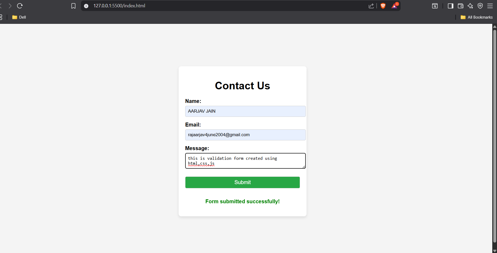

# 📩 Contact Form with JavaScript Validation – Task 6

## 📌 Objective
A responsive contact form that validates user inputs **before** submission using JavaScript.

---

## 🚀 Features
- **HTML Form** – Name, Email, and Message fields.
- **CSS Styling** – Clean and modern UI.
- **JavaScript Validation** – Prevents empty fields & invalid emails.
- **Regex Email Check** – Ensures proper email format.
- **Real-time Feedback** – Error messages below each field.
- **Success Message** – Shown when all inputs are valid.

---

## 📂 Project Structure
```
contact-form-T6/
│── index.html
│── style.css
│── script.js
│── images/
│ └── form-preview.png
└── README.md
```

---

## 📷 Preview


---

---

## 🚀 Live Preview
[Click here to view the live project](https://img.shields.io/badge/LIVE%20PREVIEW-Click%20Here-brightgreen?style=for-the-badge)](https://aarjav-jain151.github.io/contact-form-T6/)


## 🛠️ How It Works
1. **User Fills Form** – Enters Name, Email, and Message.
2. **Validation on Submit** – JavaScript checks:
   - All fields are filled.
   - Email matches a proper format.
3. **Error Messages** – If invalid, shows red text under the field.
4. **Success Message** – If valid, displays confirmation (no backend yet).

---

## 🧪 Testing
- Leave fields empty → See required field errors.
- Enter wrong email → See "Enter a valid email" error.
- Fill correctly → Shows success message.

---

## 📜 License
This project is for educational purposes.
